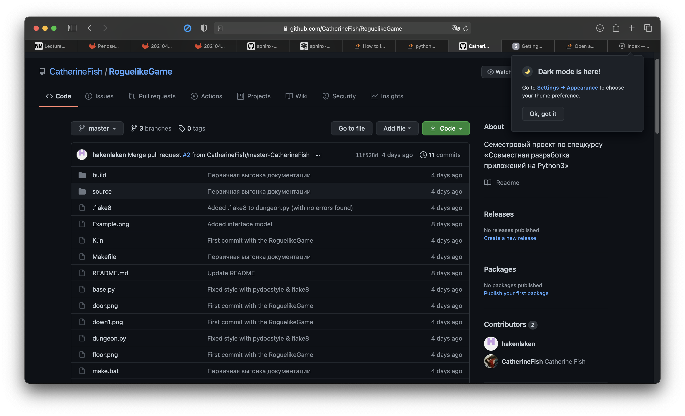

.. task1 documentation master file, created by
   sphinx-quickstart on Mon Apr 19 03:11:02 2021.
   You can adapt this file completely to your liking, but it should at least
   contain the root `toctree` directive.

Welcome to task1's documentation!
=================================

.. toctree::
   :maxdepth: 2
   :caption: Contents:

Roguelike 2D-игра с лабиринтом из комнат
----------------------------------------

`Ссылка на репозиторий <https://github.com/CatherineFish/RoguelikeGame>`_. 

Участники:
~~~~~~~~~~
- Ларин Адрей Викторович, группа 321, ник: hakenlaken
- Чехонина Екатерина Андреевна, группа 321, ник: CatherineFish

Скриншот репозитория:
~~~~~~~~~~~~~~~~~~~~~

Indices and tables
==================

* :ref:`genindex`
* :ref:`modindex`
* :ref:`search`
